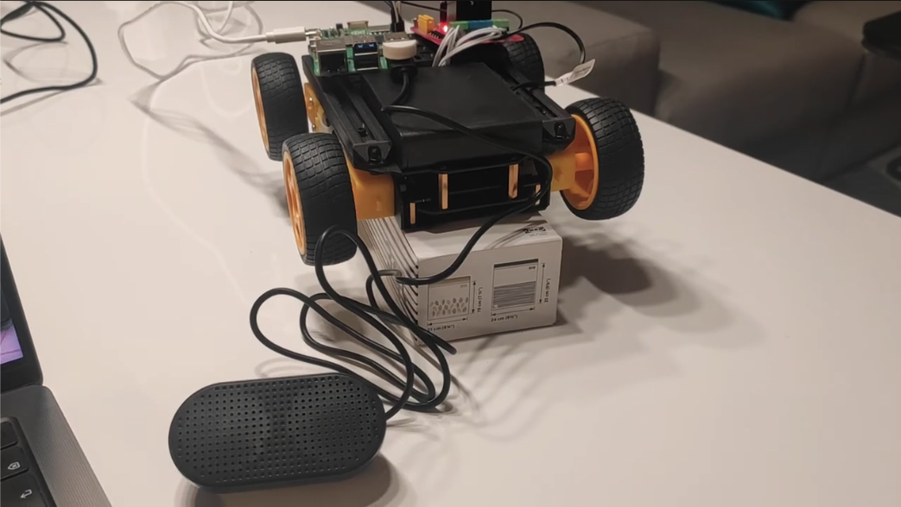

# JuniorPi

**A personal exploration of embodied intelligence.**

JuniorPi listens, speaks, and moves through AI-driven commands - connecting speech recognition, language models, and motor control on a Raspberry Pi 5.

Built as a sandbox for experimenting with autonomy, context awareness, and human-robot interaction at small scale.

---

## Why This Project?

This project explores the intersection of AI and physical robotics at a personal, experimental scale. It's about understanding how voice interaction, language understanding, and physical movement can combine to create a simple form of embodied intelligence.

Rather than building a production system, JuniorPi serves as a learning platform - a place to experiment with:
- **Speech-driven control**: Natural language commanding of a physical robot
- **Context awareness**: How AI models interpret and translate human intent into robot actions
- **Human-robot interaction**: The practical challenges of voice UI, audio feedback prevention, and responsive behavior
- **Edge AI**: Running inference locally on resource-constrained hardware vs. cloud-based processing

It's a testbed for exploring what's possible when you give an AI "eyes, ears, and legs" - even at a tiny scale.

---

## How It Works

### Hardware Requirements

- **Raspberry Pi 5** (8GB RAM recommended)
- **L298N motor controller** for GPIO-based motor control
- **USB microphone** for voice input
- **USB speaker** for TTS output
- **Waveshare car chassis** (or similar robot platform)

### Software Architecture

JuniorPi supports two operating modes:

**Cloud Mode** (Recommended - Fast):
1. Captures voice via USB mic with Voice Activity Detection (VAD)
2. Sends audio to GPT-4o Audio API for transcription + command generation (~1.5s latency)
3. Executes movement commands via GPIO motor control
4. Responds with voice via OpenAI TTS (mic paused during playback to prevent feedback)

**Local Mode** (Private - Slower):
1. Captures voice via USB mic with VAD
2. Transcribes locally using faster-whisper on Raspberry Pi 5 (~7s latency)
3. Sends text to GPT-4o-mini for command generation
4. Executes movement + TTS responses

The robot understands natural language and converts it to JSON commands for precise movement control and conversational responses.

---

## Roadmap

### Completed
- ✅ Auto-detect USB audio input and output devices
- ✅ Speech-to-text and text-to-speech integration
- ✅ Movement commands with precise timing control
- ✅ Natural language conversation with voice responses

### In Progress / Planned
- [ ] **Camera integration** - Include visual input in the decision loop to test autonomous navigation and object recognition
- [ ] **Battery power** - Add mobile power supply for true movement autonomy (untethered operation)
- [ ] **Smart home integration** - Connect to home APIs (heater, lights, etc.) for environmental control and interaction

## License

MIT

---

## Acknowledgments

Built as an experimental platform for learning about embodied AI, voice interaction, and robotics on edge devices.
